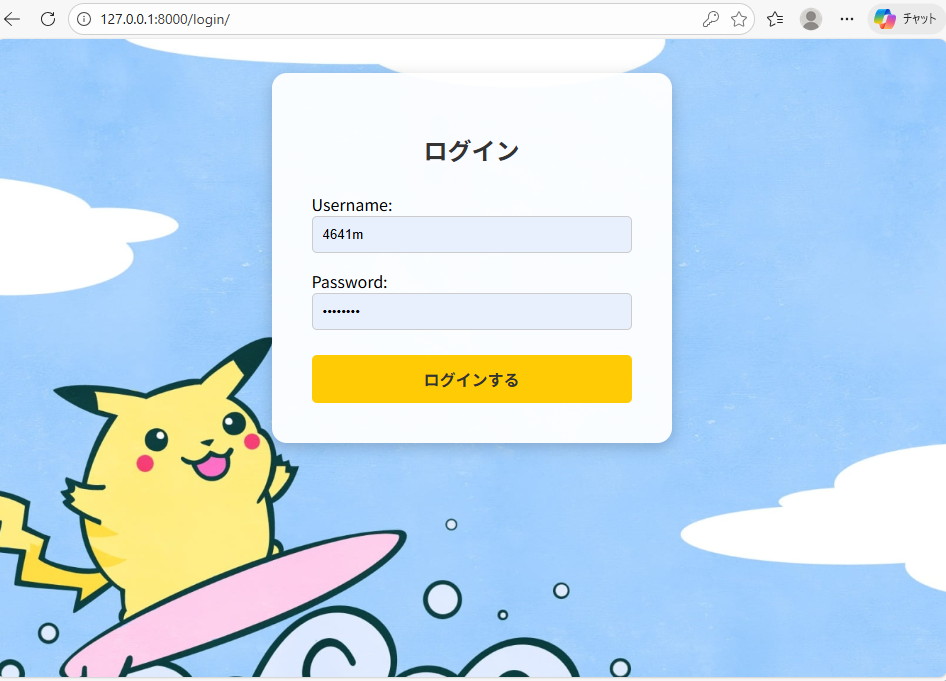
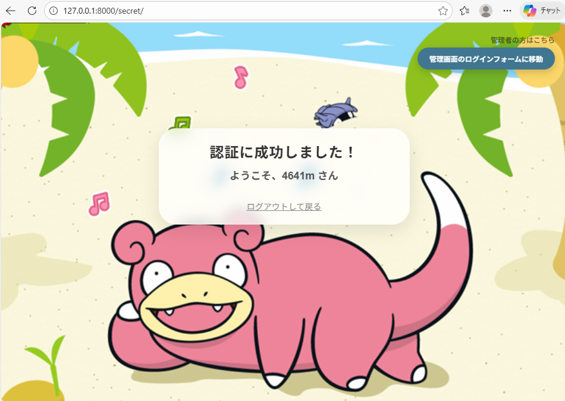
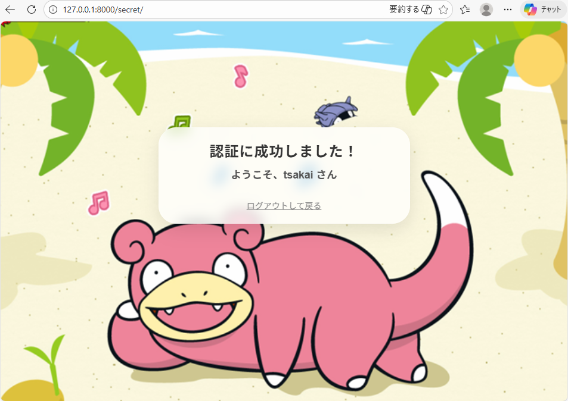
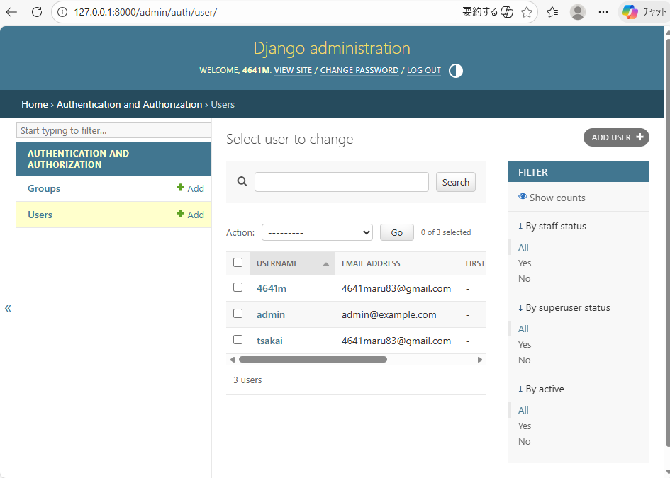

## プロジェクト概要

Django 5 を使った認証付きWebサイトです。  
ユーザーがログインすると「秘密のページ（会員専用ページ）」にアクセスできる構成になっています。  
管理者ユーザーと一般ユーザーで表示内容が異なり、管理者のみが管理画面へのリンクを表示します。


- **フレームワーク**: Django 5.2.1
- **データベース**: SQLite（`db.sqlite3`）
- **プロジェクト名**: `mysite`
- **アプリ名**: `myweb`

## ディレクトリ構成

```text
django_projects/                         # このリポジトリのルート
├─ myenv/                                # Python 仮想環境
│
└─ mysite/                               # Django プロジェクトのルート
   ├─ manage.py                          # Django 管理コマンド用スクリプト
   ├─ db.sqlite3                         # SQLite データベースファイル
   │
   ├─ mysite/                            # プロジェクト設定モジュール
   │  ├─ settings.py                     # 設定ファイル（アプリ登録・DB・テンプレート・認証設定など）
   │  ├─ urls.py                         # プロジェクト全体のURLルーティング
   │  ├─ wsgi.py                         # デプロイ用エントリポイント（WSGI）
   │  └─ asgi.py                         # デプロイ用エントリポイント（ASGI）
   │
   ├─ myweb/                             # アプリケーション本体
   │  ├─ views.py                        # ビュー（画面処理）定義
   │  ├─ urls.py                         # アプリ内URLルーティング
   │  │
   │  └─ templates/                      # HTML テンプレート
   │     ├─ secret_page.html             # ログインユーザーだけが見られる秘密のページ
   │     ├─ registration/
   │     │  └─ login.html                # ログイン画面テンプレート
   │     └─ secret_page_files/           # 参考用に保存された外部ページ等の各種ファイル（アプリからは直接は参照していません）
   │
   └─ static/                             # 静的ファイル（画像、CSS、JavaScript）
      └─ images/                          # 画像ファイル
         ├─ yadon_bg.png                  # 秘密のページの背景画像
         └─ 4276157168-suffin_pika-rRKK-1600x900-MM-100.jpg  # ログイン画面の背景画像
```

## Webサイトの構成

### 認証まわり

- Django 標準の認証機能を使用しています。
- `mysite/settings.py` で以下のように設定されています。
  - `LOGIN_URL = '/login/'`
  - `LOGIN_REDIRECT_URL = '/secret/'`
  - `LOGOUT_REDIRECT_URL = '/login/'`
- `mysite/urls.py` で、Django組み込みのビューが URL に割り当てられています。
  - `/login/` … `django.contrib.auth.views.LoginView`
  - `/logout/` … `django.contrib.auth.views.LogoutView`

### URL 構成（ルーティング）

- `mysite/urls.py`
  - `admin/` … Django 管理サイト
  - `''`（ルートパス） … ログイン画面（`LoginView`）
  - `login/` … ログイン画面
  - `logout/` … ログアウト処理
  - `''` … `myweb.urls` を include

- `myweb/urls.py`
  - `secret/` … 秘密のページ（`views.secret_page`）  
    → フルパスは `/secret/`

### ユーザー権限の違い

このプロジェクトでは、以下の2種類のユーザーが想定されています：

1. **管理者ユーザー（`is_staff=True`）**
   - 例: `4641m`
   - 秘密のページに「管理画面を開く」ボタンが表示される
   - Django管理サイト（`/admin/`）にアクセス可能


2. **一般ユーザー（`is_staff=False`）**
   - 例: `tsakai`
   - 秘密のページに「管理画面を開く」ボタンは表示されない
   - 秘密のページのコンテンツのみ閲覧可能


この違いは、`secret_page.html` テンプレート内の以下のコードで実現されています：

```html

<div class="admin-top-right">
    <a href="/admin/" class="admin-button">管理画面を開く</a>
</div>

```


### 画面の説明

### ログイン画面（`/login/`）

- Django 標準の `LoginView` を利用し、`templates/registration/login.html` が使われます。
- ユーザー名・パスワードを入力してログインします。
- 背景にピカチュウの画像が表示されます。
- ログイン成功後は `/secret/` にリダイレクトされます。
** **




### 秘密のページ（`/secret/`）

- ビュー: `myweb.views.secret_page`
- デコレーター: `@login_required` が付与されており、ログインしていないとアクセスできません。
- テンプレート: `templates/secret_page.html`
- 内容:
  - 「認証に成功しました！」というメッセージ
  - ログインユーザー名の表示（`{{ user.username }}`）
  - ログアウトボタン
  - **管理者ユーザーのみ**「管理画面を開く」ボタンが右上に表示されます

**サンプル画面（管理者ユーザー: 4641m）:**



管理者ユーザー（`is_staff=True`）でログインすると、右上に「管理画面を開く」ボタンが表示され、Django管理サイト（`/admin/`）にアクセスできます。

**サンプル画面（一般ユーザー: tsakai）:**



一般ユーザー（`is_staff=False`）でログインすると、「管理画面を開く」ボタンは表示されません。秘密のページのコンテンツのみが表示されます。

#### Django管理サイト（`/admin/`）

- 管理者ユーザー（`is_staff=True`）のみがアクセス可能な管理画面です。
- ユーザーの作成・編集・削除、権限の設定などが行えます。
- 秘密のページから「管理画面を開く」ボタンをクリックするか、直接 `/admin/` にアクセスしてログインします。

**サンプル画面（管理サイト - ユーザー一覧）:**



管理サイトでは、以下の操作が可能です：

- **ユーザー管理**: ユーザーの作成・編集・削除、`is_staff`（管理者権限）の設定
- **グループ管理**: ユーザーグループの作成と管理
- **権限管理**: ユーザーやグループへの権限の付与

このプロジェクトでは、以下の3人のユーザーが登録されています：

- `4641m` - 管理者ユーザー（`is_staff=True`）
- `admin` - 管理者ユーザー（`is_staff=True`）
- `tsakai` - 一般ユーザー（`is_staff=False`）

## 開発環境のセットアップ

1. 仮想環境を有効化（Windows PowerShell の例）:

   ```powershell
   cd C:\Users\4641m\projects\django_projects
   .\myenv\Scripts\Activate.ps1
   ```

2. 依存パッケージ（Django など）は `myenv` に既にインストールされています。  
   新規環境の場合は、必要に応じて以下のようにインストールします。

   ```powershell
   pip install django
   ```

## 開発サーバの起動方法

1. プロジェクトディレクトリへ移動:

   ```powershell
   cd C:\Users\4641m\projects\django_projects\mysite
   ```

2. 開発サーバを起動:

   ```powershell
   python manage.py runserver
   ```

3. ブラウザでアクセス:

   - ログイン: `http://127.0.0.1:8000/login/`
   - 秘密のページ: `http://127.0.0.1:8000/secret/`（ログイン後）
   - 管理サイト: `http://127.0.0.1:8000/admin/`（管理者ユーザーのみ）

※ 管理サイトやログインに使うユーザーは、以下で作成します。

```powershell
python manage.py createsuperuser
```

スーパーユーザーを作成すると、`is_staff=True` が自動的に設定され、管理者権限が付与されます。  
一般ユーザーを作成する場合は、Django管理サイトからユーザーを作成し、`is_staff` のチェックを外してください。

## 主な機能

- ユーザー認証機能（ログイン・ログアウト）
- ログイン必須ページ（`@login_required` デコレーター）
- 管理者権限による表示の切り替え（`user.is_staff` による条件分岐）
- カスタムテンプレート（背景画像付きのログイン画面・秘密のページ）


